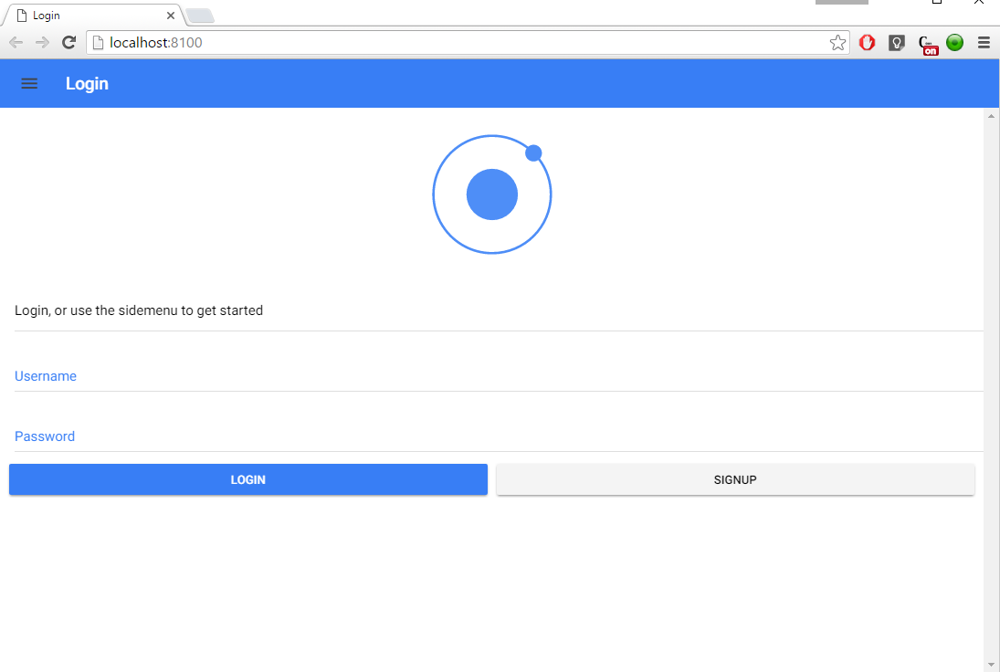
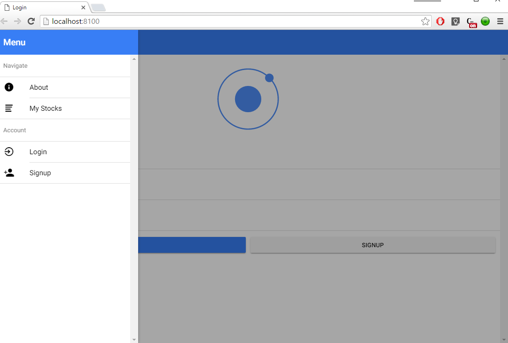
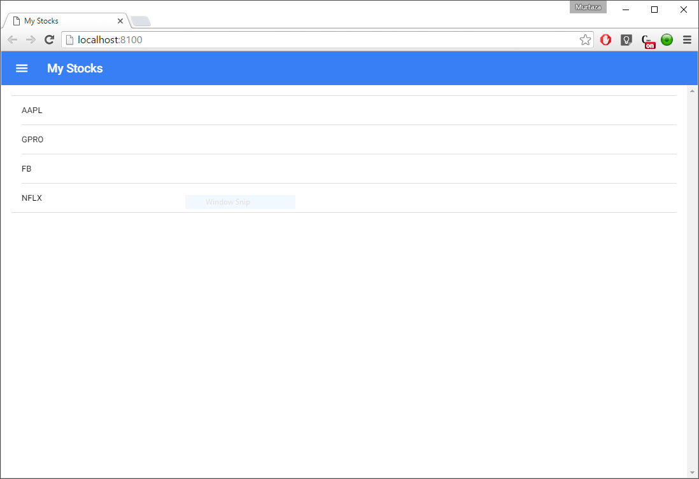
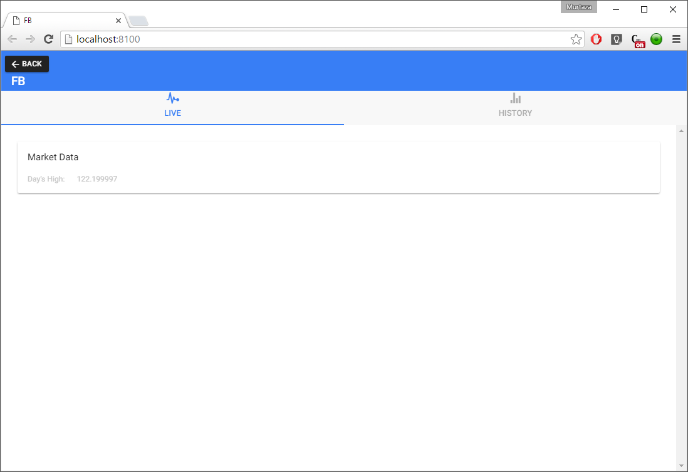
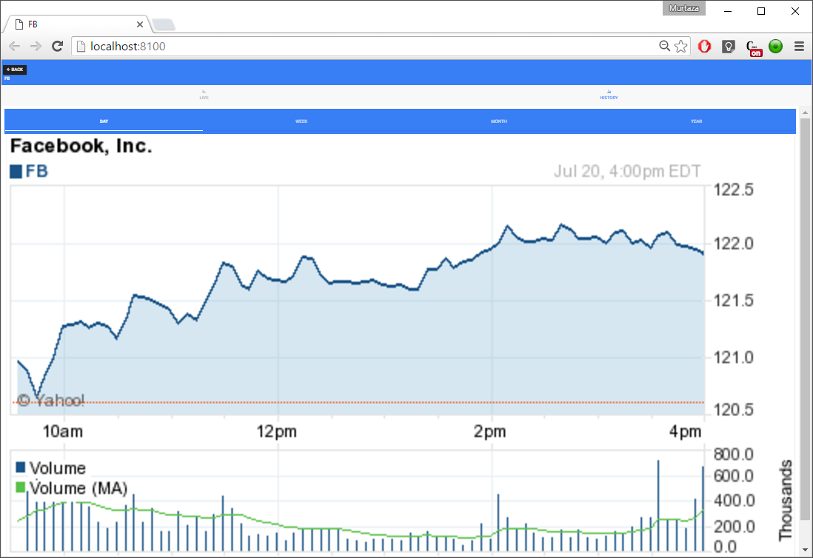
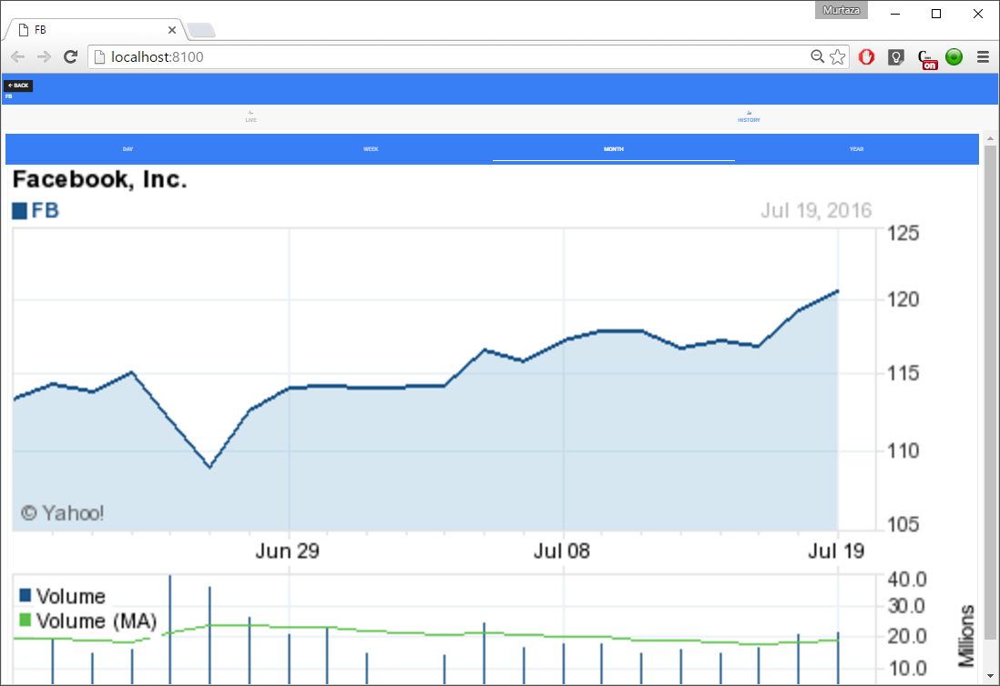

# My Stocks App

## About
This App lists stocks and displays live as well as historic data. The App uses Angularv2 and is based on the Ionic Conference scaffolding.

## App Preview

<!-- GIF of MD app -->

